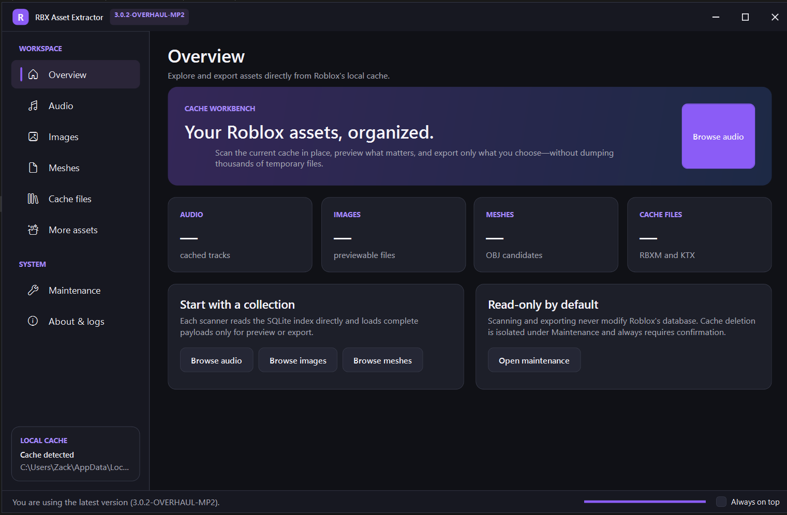

# RBX Asset Extractor

[Official website](https://rbx-asset-extractor.vexthatprotogen.com/)

RBX Asset Extractor is a Windows desktop application for finding, previewing, and exporting assets stored in Roblox's local cache. It can recover audio, videos, images, meshes, models, textures, fonts, thumbnails, and metadata without dumping the entire cache into temporary folders.



## Download

[Download the latest release from GitHub](https://github.com/zv8001/RBX-Audio-Extractor/releases/latest)..

Download and run `RBXAssetExtractor.exe`. The compact release bundles its native SQLite, image, and WebView2 loader libraries but requires the 64-bit .NET 10 Desktop Runtime. Video preview also requires the Microsoft Edge WebView2 Runtime, which is normally already installed on supported Windows systems.

RBX Asset Extractor currently supports 64-bit Windows.

## Quick start

1. Run Roblox or Roblox Studio at least once so a local asset cache exists.
2. Open RBX Asset Extractor.
3. Choose **Audio**, **Videos**, **Images**, **Meshes**, or **More assets**. Cache files are available as a tab inside **More assets**.
4. Select **Scan cache**.
5. Preview an item or export the selected results.

The cache location is detected automatically. Most assets use their Roblox cache key as the filename because the original public asset name is not always stored locally.

## Supported assets

- **Audio:** OGG and MP3 discovery, duration sorting, playback, seeking, and export.
- **Videos:** Cached HLS/WebM discovery, quality and duration details, playback, seeking, playlist-package export, and lossless single-file WebM export.
- **Images:** PNG, JPEG, BMP, and WebP preview and export.
- **Meshes:** Roblox mesh detection, interactive 3D preview, and OBJ conversion.
- **More assets:** RBXM models, KTX/KTX2 textures, thumbnails, TrueType/OpenType fonts, JSON, XML, and playlist metadata.
- **Bulk export:** Export an individual result or an entire supported category.

## Saved asset names

Select any scanned asset and choose **Rename** to replace its randomized cache key with a recognizable local name. Renaming is supported for audio, videos, images, meshes, RBXM/KTX files, thumbnails, fonts, and metadata.

The application fingerprints renamed payloads with SHA-256 and stores the name in its own SQLite database:

```text
%LocalAppData%\RBXAssetExtractor\RBXAssetExtractor.db
```

These names remain available if the executable is moved, replaced, or deleted. Custom names are also used as suggested export filenames. The **Maintenance** page can permanently clear every saved name and other RBX Asset Extractor application data.

## Fast, local cache access

Normal scans open Roblox's SQLite cache in read-only mode. Assets are read only when needed for identification, preview, playback, or export. The application does not copy the entire cache into a temporary extraction folder.

RBX Asset Extractor is not an exploit or DLL injector. It does not attach to Roblox, inject code, or read or write the running game's memory; it operates only on local cache files already stored on the computer.

Your cached assets are not uploaded. Internet access is used for version checks, creator messages, project links, and downloading an update when you approve it.

## Cache maintenance

The **Maintenance** page can open the Roblox cache folder or clear it. Clearing the cache is destructive and removes Roblox's locally cached assets, so the application asks for confirmation first.

If Roblox or Studio is locking the cache, the application can offer to close their processes. Read both confirmation dialogs carefully—this can close Roblox Studio and any unsaved work.

## Troubleshooting

### Cache not detected

Launch Roblox or Roblox Studio once, then restart RBX Asset Extractor. The expected database location is:

```text
%LocalAppData%\Roblox\rbx-storage.db
```

### A scan returns no results

Roblox only stores assets that have been downloaded on your computer. Join a game or open a Studio project containing the asset, then scan again.

### Windows warns about the executable

Only download releases from this GitHub repository or the official project updater. Windows may show a reputation warning for applications that are not code-signed.

### An update is available

The application checks the hosted version when it starts. Accepting the custom update prompt downloads the current release over HTTPS and restarts the application.

### Video preview is unavailable

Install or repair the [Microsoft Edge WebView2 Runtime](https://developer.microsoft.com/en-us/microsoft-edge/webview2/) and reopen RBX Asset Extractor. Exporting a video package does not require the preview window.

### The application reports a crash

Unexpected application errors are shown in an error dialog and written to:

```text
%LocalAppData%\RBXAssetExtractor\Logs
```

Include the newest crash log when reporting a problem.

## Links

- [Official project website](https://rbx-asset-extractor.vexthatprotogen.com/)
- [Creator website](http://vexthatprotogen.com/)
- [GitHub repository](https://github.com/zv8001/RBX-Audio-Extractor)
- [Changelog](CHANGELOG.md)

Made by **Vex**.
